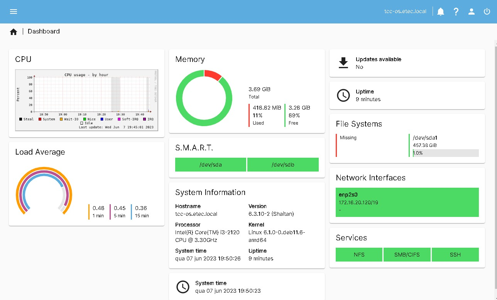
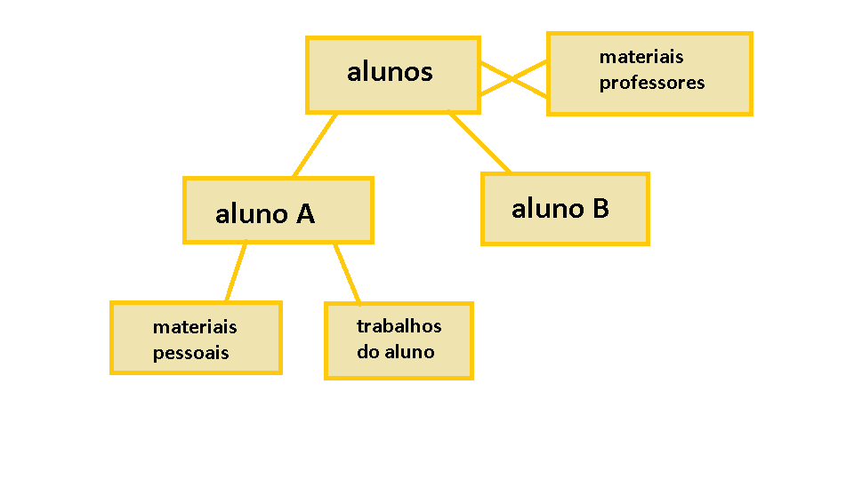
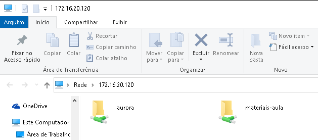
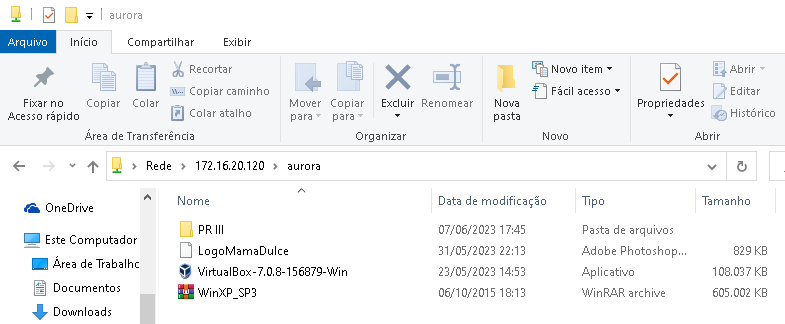

# 📂 Pen Drive Digital – Servidor de Armazenamento Didático
## 📖 Visão Geral
Este projeto implementa um **servidor de armazenamento em rede (NAS)** utilizando **Linux Debian** e ferramentas como **TrueNAS** e **OpenMediaVault**. O sistema permite que usuários (alunos e professores) acessem e compartilhem arquivos de forma organizada, com controle de permissões e autenticação por login e senha.

--- 
## 🛠️ Tecnologias Utilizadas
- **Sistema Operacional:** Linux Debian
- **NAS:** TrueNAS, OpenMediaVault
- **Serviços de Rede:** Samba (SMB), FTP
- **Hardware:** Servidor físico (Storage/Desktop)
- **Alternativa em Nuvem:** Azure, AWS

--- 
## ⚙️ Implementação

### 1. Instalação do Servidor
Preparação do ambiente em **Linux Debian**, configuração inicial de rede (endereçamento IP e hostname) e instalação do **TrueNAS/OpenMediaVault** para gerenciar o servidor.

### 2. Estrutura de Diretórios
A organização de pastas foi criada para separar o uso individual e coletivo, garantindo que professores, alunos e arquivos compartilhados tenham seus próprios espaços e controles de acesso:

- **Professores** (acesso restrito por login)
  - Materiais
  - Relatórios
- **Alunos** (cada aluno possui sua própria pasta privada)
  - aluno01
  - aluno02
  - ...
- **Compartilhado** (materiais acessíveis a todos)
  - ArquivosDidaticos

 
### 3. Controle de Usuários
Cada usuário recebe login e senha individuais para acessar o servidor de forma segura. As permissões são configuradas para que pastas privadas tenham acesso exclusivo e pastas públicas possam ser lidas e escritas por todos.

### 5. Dashboard de Gerenciamento
Com o OpenMediaVault ou TrueNAS, é possível administrar o servidor via interface gráfica, facilitando tarefas como criação e exclusão de usuários, gerenciamento de permissões, monitoramento de consumo de armazenamento e criação de backups.

### 6. Segurança e Políticas
Autenticação obrigatória via login e senha. Termo de uso definido para evitar armazenamento de mídias não didáticas. Possibilidade de integração com Active Directory (AD) para ambientes maiores. Backup planejado com RAID e cópias externas, garantindo integridade e segurança dos dados.

### 7. Possibilidades de Expansão
Acesso remoto via FTP ou VPN para administração e uso à distância. Integração com nuvem (Azure/AWS) para redundância e armazenamento seguro. Uso corporativo para organização de dados internos, centralização de arquivos e distribuição de atualizações.

### 8. Exemplos Visuais

Esquema de como ficarima as pastas na Rede

Como ficou a estrutura de pastas no SAMBA

Pequeno exemplo de alaguns arquivos compartilhados na rede 

